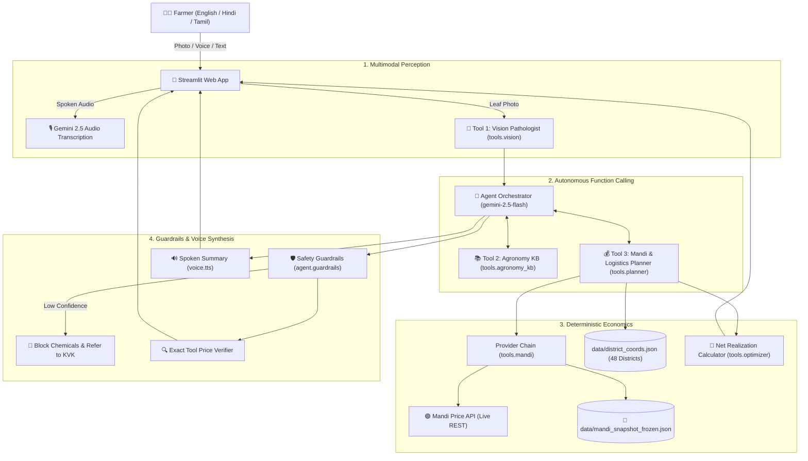

# 🌾 KrishiChain Bharat — Autonomous Agri-Agent for Smallholders

> **Bharat Agentic Hackathon 2026 Submission**  
> *Domain: AgriTech & Rural Bharat* · *Powered by Google Gemini 2.5 Flash & Deterministic Tool Calling*

---

## 📌 Problem Statement
Indian smallholder farmers face a persistent double crisis:
1. **Misdiagnosed Crop Disease**: Up to 30% of harvest is lost to late or incorrect chemical application.
2. **The "Headline Price Trap"**: Mandis in distant metropolitan centers advertise high modal prices, but transport costs, loading fees, APMC commission, and perishable spoilage often turn that headline gain into a net loss.
3. **Hallucination & Language Barriers**: Generic chatbots invent prices, dosages, and distances while communicating in English that is inaccessible to rural Bharat.

---

## 🚀 Solution: KrishiChain Bharat
**KrishiChain** is an autonomous multi-tool agent that provides end-to-end diagnosis, ICAR/TNAU-verified remedies, and true **Net Realization** mandi optimization in the farmer's native language (Hindi, Tamil, English).



---

## 🛠️ Tool Suite & Architecture

| Tool | Module | Purpose | Deterministic Guarantee |
| :--- | :--- | :--- | :--- |
| `analyze_leaf_image` | `tools.vision` | Diagnoses leaf diseases using Gemini 2.5 vision with Pydantic schema validation. | Clamps severity & confidence to `[0.0, 1.0]`. Triggers low-confidence flag when `< 0.60`. |
| `lookup_remedy` | `tools.agronomy_kb` | Retrieves organic treatments, chemical doses, and Pre-Harvest Interval (PHI) from curated KB. | Pure local lookup from `data/kb.json`. Doses are never generated by LLM. |
| `compute_sell_plan` | `tools.planner` | Queries multi-provider mandi prices and ranks markets by net realization after deducting transport, commission, loading, and spoilage. | Deterministic net realization math in `tools.optimizer`. Returns `known_districts` on unknown queries. |
| `transcribe_audio` | `voice.transcribe` | Transcribes farmer's speech in Hindi, Tamil, or English into text. | Uses zero-temperature Gemini multimodal audio. |
| `generate_speech` | `voice.tts` | Synthesizes a 5-sentence concise spoken summary in the farmer's native tongue. | Real audio generated via `gTTS` with zero placeholder audio. |

---

## 📊 Data Infrastructure & Honest Labeling

1. **Multi-Provider Chain**:
   $$\text{Live Mandi API (onrender.com)} \longrightarrow \text{data.gov.in (Agmarknet)} \longrightarrow \text{Frozen Real Snapshot} \longrightarrow \text{Seed Snapshot}$$
2. **Data Badges in UI**:
   - `🟢 LIVE (Mandi Price API, date)`: Live real-time daily mandi prices fetched from 200+ Maharashtra markets.
   - `🔵 FROZEN REAL (date)`: Real Agmarknet wholesale data frozen from Mandi Price API (`data/mandi_snapshot_frozen.json`).
   - `🟡 SEED (date illustrative)`: Benchmark fallback data.

### Net Realization Cost Model
$$\text{Net Take-Home Pay} = \text{Gross Revenue} - \text{Freight} - \text{APMC Commission (2\%)} - \text{Loading (₹15/qtl)} - \text{Spoilage Loss}$$
- **Freight**: $\text{₹2.00} \times \text{distance (km)} \times \text{quantity (qtl)}$
- **Road Distance**: Haversine distance $\times 1.30$ road winding factor.
- **Spoilage**: Perishable commodities incur 1% loss per 100 km transit (Tomato 2.5%, Onion 0.5%).

---

## 🛡️ Safety Guardrails & Verifications
- **Low Confidence Guardrail**: Blurry or non-leaf photos (<60% confidence) immediately block chemical pesticide recommendations and direct the farmer to take a clearer photo or visit the nearest Krishi Vigyan Kendra (KVK).
- **Severe Infestation Escalation**: Severity $\ge 70\%$ automatically mandates consulting local KVK officers and recommends immediate harvest of sound produce.
- **Numeric Grounding Verifier**: Deterministic code checks all rupee amounts, dosages, and distances in the final LLM text against tool payloads, flagging any discrepancies.

---

## ⚖️ Known Limitations & Assumptions
1. **Demo Cache**: Demo cache scenarios are pre-recorded for offline reliability and reproducible demonstrations.
2. **Direct-to-Buyer Guidance**: Direct-buyer options (e-NAM, FPOs, processors) are general guidance only; farmers must verify buyer terms before committing.
3. **Microphone Permissions**: Browser voice recording (`st.audio_input`) requires a `localhost` or HTTPS browser context.
4. **Live TTS Audio Generation**: `gTTS` voice audio generation requires an active internet connection during live execution (cached audio is stored locally for demo runs).
5. **State Coverage**: Live Mandi Price API provides live wholesale data for Maharashtra, UP, Punjab, MP, and Karnataka. Other states fall back to frozen real or benchmark data.
6. **Transport Assumptions**: Model assumes ₹2/qtl/km freight rate and 2% APMC commission; actual rates vary with local market conventions.

---

## ⚡ Setup & Quickstart

### Prerequisites
- Python 3.10+
- A Google Gemini API Key from [Google AI Studio](https://aistudio.google.com/)

### Installation
```bash
# 1. Clone repository
git clone https://github.com/VarunikaShreeS/agri-agent-bharat.git
cd agri-agent-bharat

# 2. Create virtual environment
python -m venv .venv
# On Windows:
.venv\Scripts\activate
# On macOS/Linux:
source .venv/bin/activate

# 3. Install dependencies
pip install -r requirements.txt

# 4. Configure environment
cp .env.example .env
# Open .env and add your GEMINI_API_KEY
```

### Run Application
```bash
streamlit run app.py
```

### Run Offline Test Suites (100% Offline Passing)
```bash
python tests/test_tools.py
python tests/test_agent_contract.py
python tests/test_mandi_adapters.py
python tests/test_robustness_guardrails.py
```

### Offline Demo Mode
To run KrishiChain without an API key or internet connection:
```bash
# Set in .env or run directly:
DEMO_MODE=1 streamlit run app.py
```
Select from pre-recorded scenarios (English Early Blight, Hindi Leaf Curl, Tamil Early Blight) with playable regional audio.
